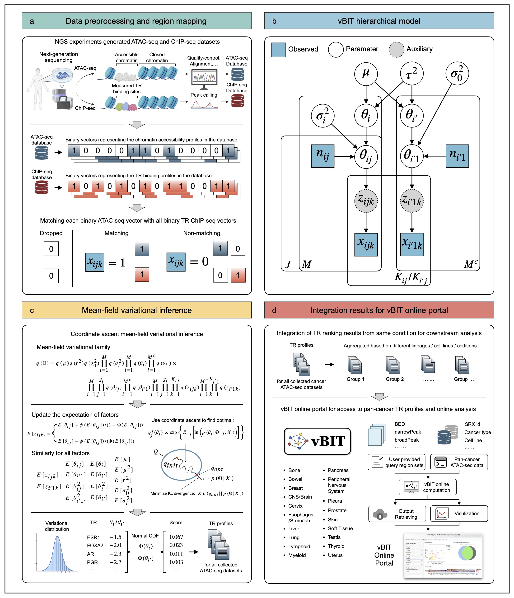

<!-- README.md is generated from README.Rmd. Please edit that file -->

<!-- badges: start -->

<!-- badges: end -->

<p align="center" width="100%">


</p>

## epigenomics-based Transcriptional Regulators explorer
This package is part of the manuscript: "eTRex Reveals Oncogenic Transcriptional Regulatory Programs Across Human Cancers"


**eTRex** is designed to identify transcriptional regulators from user-provided epigenomic region sets with improved computational efficiency, better user experience, and enhanced error handling. This package leverages a pre-processed reference library containing over 10,000 human TR ChIP-seq datasets and over 5,000 mouse TR ChIP-seq datasets.

<p align="center">

</p>

## Key Features

- **Improved Computational Efficiency**: Improved computational efficiency with mean-field variational inference
- **Enhanced Error Handling**: Comprehensive input validation and user-friendly error messages
- **Better User Experience**: Progress messages, detailed summaries, and informative feedback
- **Modular Design**: Refactored functions with better code organization and maintainability
- **Flexible Filtering**: Enhanced region filtering with detailed statistics

## Installation

You can install the development version of eTRex from [GitHub](https://github.com/ZeyuL01/eTRex) with:

```r
# install.packages("devtools")
# devtools::install_github("ZeyuL01/eTRex")
# library(eTRex)
```

### System Requirements

For Mac users, please refer to: [Rcpp on macOS](https://thecoatlessprofessor.com/programming/cpp/r-compiler-tools-for-rcpp-on-macos/)

For Windows users, please refer to: [R Development on Windows](https://cran.r-project.org/bin/windows/base/howto-R-devel.html)

## 🌐 Online Web Portal

**No installation required!** We offer a convenient online web portal that implements TRex:

**[www.e-TRex.org](https://www.e-TRex.org)**

The web portal provides the same functionality as the R package without requiring any local installation or setup. Simply upload your data and get results instantly.

## Reference ChIP-seq Data

TRex uses the same pre-compiled reference data as BIT, containing 10,140 TR ChIP-seq datasets associated with 988 human TRs and 5,681 TR ChIP-seq datasets associated with 607 mouse TRs. These data can be downloaded from the Zenodo online data repository:

| Bin Width | hg38 Download Link | mm10 Download Link |
|-----------|-------------------|-------------------|
| 1000 | [hg38_1000.tar.gz](https://zenodo.org/records/14231098/files/hg38_1000.tar.gz?download=1) | [mm10_1000.tar.gz](https://zenodo.org/records/14231098/files/mm10_1000.tar.gz?download=1) |
| 500 | [hg38_500.tar.gz](https://zenodo.org/records/14231098/files/hg38_500.tar.gz?download=1) | [mm10_500.tar.gz](https://zenodo.org/records/14231098/files/mm10_500.tar.gz?download=1) |
| 200 | [hg38_200.tar.gz](https://zenodo.org/records/14231098/files/hg38_200.tar.gz?download=1) | [mm10_200.tar.gz](https://zenodo.org/records/14231098/files/mm10_200.tar.gz?download=1) |

**Note: TRex cannot run without the reference data. Please load the reference ChIP-seq database after installation.**

## Quick Start Guide

### 1. Load ChIP-seq Data

```r
# Download and unzip the ChIP-seq data to a local directory
# Example: /path/to/data/ChIP-seq/hg38/

chip_path <- "/path/to/data/ChIP-seq/hg38/"

# Load the data (run once)
load_chip_data(chip_path, bin_width = 1000, genome = "hg38")

# Check loaded data
check_loaded_chip_data()
```

### 2. Run TRex Analysis

```r
# Input file path (supports bed, narrowPeak, broadPeak, bigNarrowPeak, csv)
input_path <- "path/to/your/peaks.bed"
output_path <- "path/to/output/"

# Run TRex analysis
eTRex(input_path, output_path, N = 5000, bin_width=1000, genome = "hg38")
```

### 3. View Results

```r
# Load and view results
results <- read.csv(paste0(output_path, "peaks_rank_table.csv"))
head(results)
```


## Function Reference

### Core Functions

- `eTRex()`: Main analysis function
- `load_chip_data()`: Load and organize ChIP-seq reference data
- `check_loaded_chip_data()`: View loaded ChIP-seq data information
- `import_input_regions()`: Import and process genomic regions
- `alignment_wrapper()`: Compare input regions with reference data

## Supported File Formats

eTRex supports multiple input file formats:

- **BED**: Standard BED format
- **narrowPeak**: ENCODE narrowPeak format
- **broadPeak**: ENCODE broadPeak format
- **bigNarrowPeak**: BigWig narrowPeak format
- **CSV**: Custom CSV format with Chrom, Start, End columns

## Hardware Requirements

### Minimum Requirements
- **RAM**: 8 GB
- **Storage**: 10 GB free space for reference data
- **CPU**: Multi-core processor recommended

### Recommended Specifications
- **RAM**: 16 GB or more
- **Storage**: 20 GB free space
- **CPU**: 8+ cores for faster processing

## Citation

If you use eTRex in your work, please cite:

**eTRex Reveals Oncogenic Transcriptional Regulatory Programs Across Human Cancers
Zeyu Lu, Yuqiu Yang, Qiang Zheng, Feng Gao, Lin Xu, Xinlei Wang
bioRxiv 2026.01.16.699950; doi: https://doi.org/10.64898/2026.01.16.699950**

## Contact

- **Dr. Xinlei (Sherry) Wang**: [UT Arlington](https://www.uta.edu/academics/faculty/profile?username=wangx9)
- **Dr. Lin Xu**: [UT Southwestern](https://qbrc.swmed.edu/labs/xulab/)

## License

This project is licensed under the MIT License - see the LICENSE file for details.

## Acknowledgments

eTRex builds upon the original BIT tool and includes contributions from the bioinformatics community. Special thanks to all contributors and users who provided feedback and suggestions for improvements.
